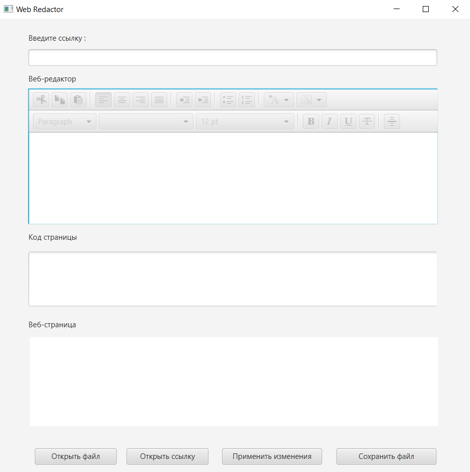
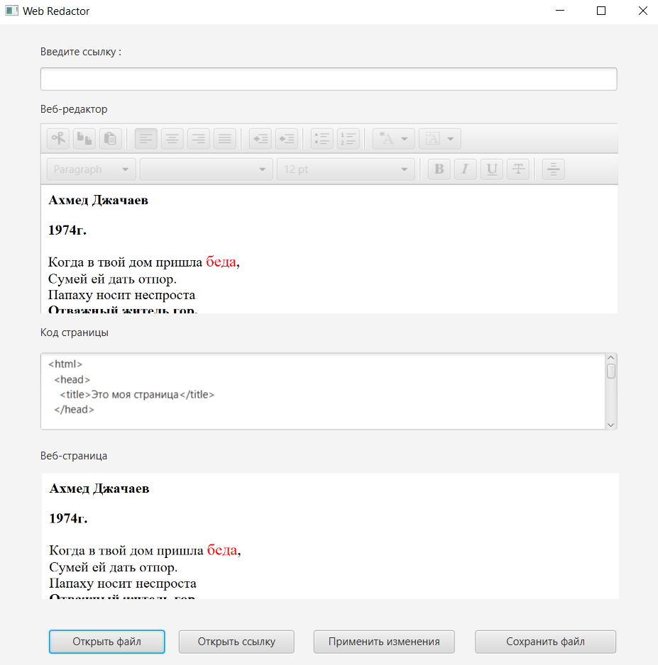
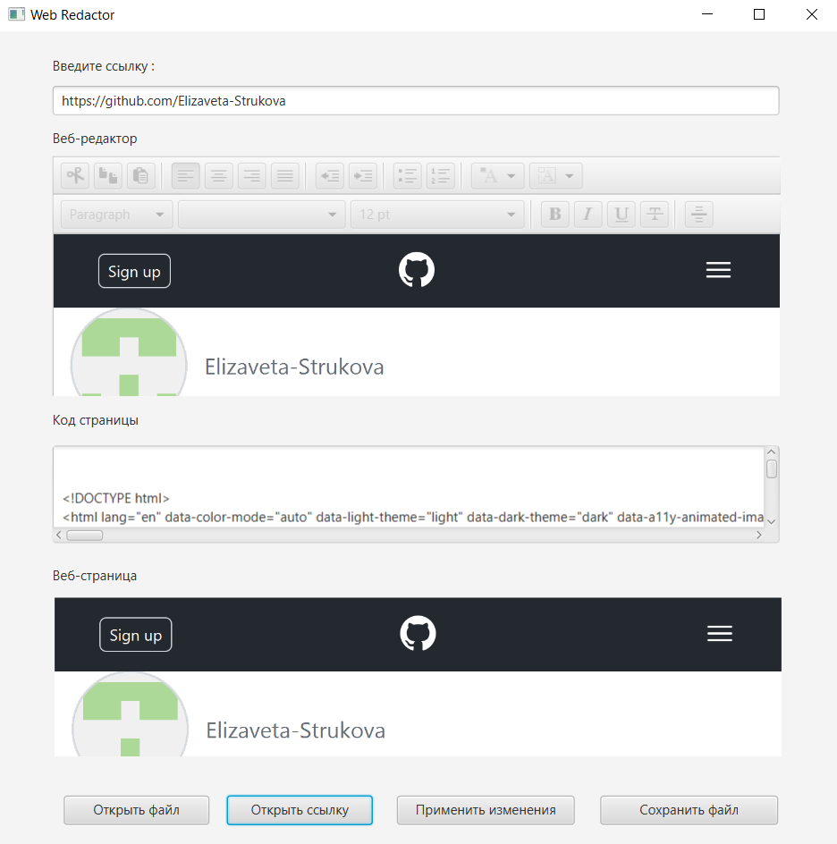

# Web-Redactor
## В ходе выполнения задания, в практической работе было реализовано:
Программное средство, которое позволяет загружать, изменять, сохранять и создавать новый html-файл
## Интерфейс программы
### Главное окно программы.

### Открытие файла.

### Открытие URL страницы.

